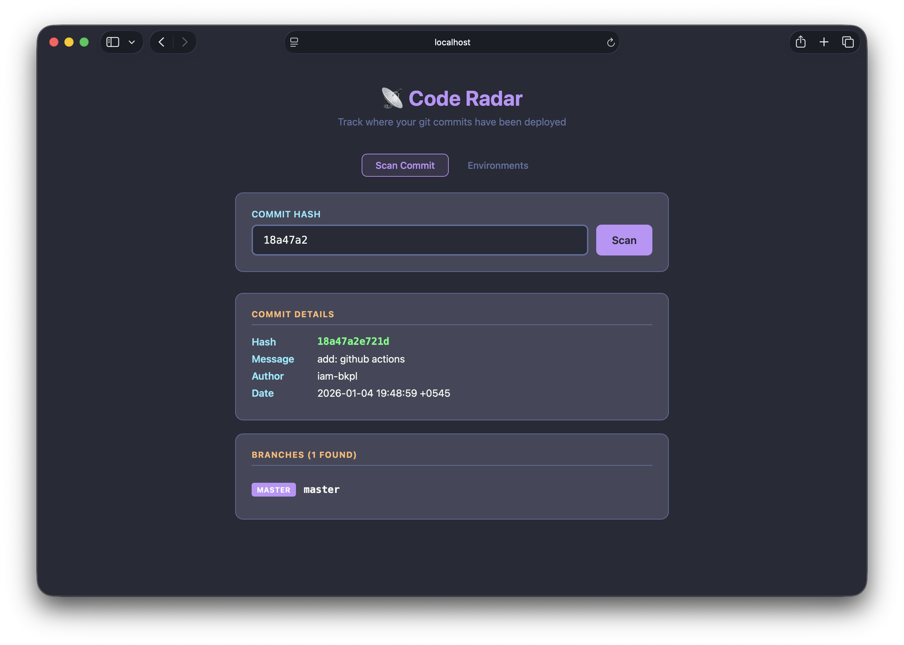
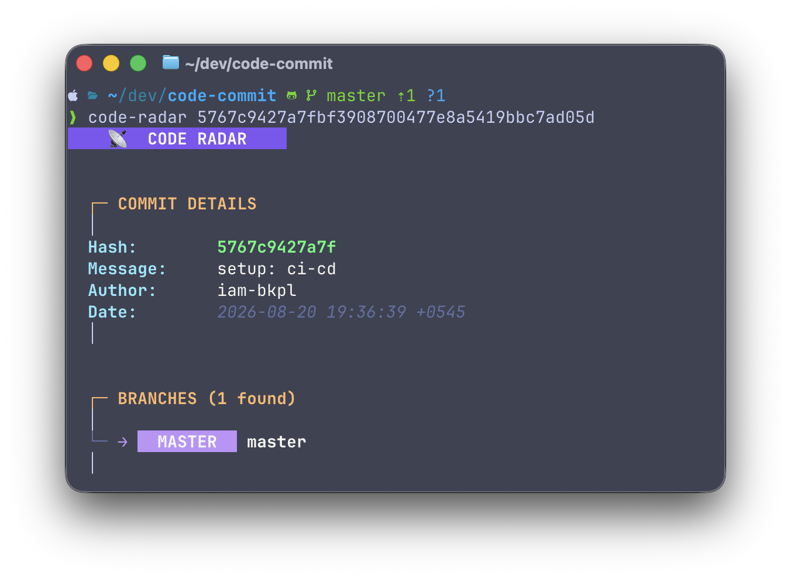

# Code Radar

Track where your git commits have been deployed across branches.



## Purpose

When you merge code into `develop`, it can flow to multiple branches:
- `qa` → `uat` → `staging` → `master` → `prod`

Code Radar helps you visualize which branches contain a specific commit across your remote repositories.

## Installation

### macOS (Homebrew) — Recommended

```bash
brew tap iam-bkpl/tap
brew install code-radar
```

**If macOS blocks the app** (untrusted developer):

```bash
xattr -cr /opt/homebrew/bin/code-radar
```

Then run `code-radar` normally.

### Linux (curl script)

```bash
curl -fsSL https://raw.githubusercontent.com/iam-bkpl/code-radar/main/install.sh | bash
```

This installs to `/usr/local/bin/code-radar`.

**Manual install:**

```bash
# Download latest (replace version and arch as needed)
ARCH=$(uname -m)
VERSION=$(curl -s https://api.github.com/repos/iam-bkpl/code-radar/releases/latest | grep tag_name | cut -d'"' -f4)
curl -LO "https://github.com/iam-bkpl/code-radar/releases/download/${VERSION}/code-radar_Linux_${ARCH}.tar.gz"
tar xzf code-radar_Linux_*.tar.gz
sudo mv code-radar /usr/local/bin/
sudo chmod +x /usr/local/bin/code-radar
```

### Build from Source

```bash
git clone https://github.com/iam-bkpl/code-radar.git
cd code-radar
go build -o code-radar
sudo mv code-radar /usr/local/bin/
```

## Upgrading

### macOS

```bash
brew upgrade code-radar
```

If you get trust errors after upgrade:

```bash
xattr -cr /opt/homebrew/bin/code-radar
```

### Linux

Re-run the install script:

```bash
curl -fsSL https://raw.githubusercontent.com/iam-bkpl/code-radar/main/install.sh | bash
```

Or download the latest release manually (see [Linux install](#linux-curl-script) above).

### From Source

```bash
cd code-radar
git pull
go build -o code-radar
sudo mv code-radar /usr/local/bin/
```

## Usage

### CLI

```bash
# Scan a commit
code-radar <commit-hash>

# Compact output
code-radar --short <commit-hash>

# JSON output (for scripting)
code-radar --json <commit-hash>

# Interactive mode
code-radar

# Start web UI
code-radar --web

# Generate config file
code-radar --init
```

### Web UI

```bash
code-radar --web
# Open http://localhost:9876 in your browser
```

### Flags

| Flag | Short | Description |
|------|-------|-------------|
| `--help` | `-h` | Show help message |
| `--version` | `-v` | Show version |
| `--json` | `-j` | Output as JSON |
| `--short` | `-s` | Compact one-line output |
| `--web` | | Start web UI on port 9876 |
| `--init` | | Generate `.code-radar.yaml` config |

## Configuration

Create a `.code-radar.yaml` in your project root (or `~/.config/code-radar/config.yaml` globally):

```bash
code-radar --init
```

Default config:

```yaml
environments:
  - name: DEV
    pattern: [develop, dev]
    color: "#6272A4"
  - name: QA
    pattern: [qa, test, release]
    color: "#F1FA8C"
  - name: UAT
    pattern: [uat]
    color: "#FFB86C"
  - name: STAGING
    pattern: [staging, stg]
    color: "#8BE9FD"
  - name: MASTER
    pattern: [master, main]
    color: "#BD93F9"
  - name: PROD
    pattern: [prod, production]
    color: "#FF5555"
```

Customize to match your branch naming:

```yaml
environments:
  - name: FEATURE
    pattern: [feature, feat]
    color: "#50FA7B"
  - name: RELEASE
    pattern: [release, rel]
    color: "#FFB86C"
```

**Matching**: Branch names are matched case-insensitively using exact match or contains. First match wins.


## Troubleshooting

### macOS: "code-radar cannot be opened because the developer cannot be verified"

macOS Gatekeeper blocks unsigned binaries. Fix with:

```bash
xattr -cr /opt/homebrew/bin/code-radar
```

If installed elsewhere:

```bash
xattr -cr $(which code-radar)
```

### macOS: "operation not permitted" after Homebrew upgrade

```bash
xattr -cr /opt/homebrew/bin/code-radar
```

### Linux: "permission denied"

Make the binary executable:

```bash
chmod +x /usr/local/bin/code-radar
```

Or if installed to a custom location:

```bash
chmod +x $(which code-radar)
```

### Linux: "no such file or directory" after install

Ensure `/usr/local/bin` is in your PATH:

```bash
export PATH="/usr/local/bin:$PATH"
```

Add to `~/.bashrc` or `~/.zshrc` to persist.

### "commit not found"

Make sure you're in a git repository and the commit exists locally. If it only exists on a remote, fetch first:

```bash
git fetch --all
```

Code Radar auto-fetches, but if it fails you can fetch manually.

### Web UI: "address already in use"

Port 9876 is in use. Kill the existing process:

```bash
lsof -ti:9876 | xargs kill
```

### Homebrew: "tap trust is required"

```bash
brew untap microsoft/mssql-release mongodb/brew
```

Or trust only what you need:

```bash
brew tap-info iam-bkpl/tap
brew install iam-bkpl/tap/code-radar
```

## Features

- Scans remote branches only (not local)
- Auto-fetches before scanning
- Configurable environments with custom patterns and colors
- Web UI with config editor
- JSON output for scripting
- Loading spinner in terminal
- Cross-platform (macOS, Linux, Windows)

## License

MIT License - see [LICENSE](LICENSE) for details.
